# Пайплайн Download and Copy RVT and NWC

**Инструкция пользователя.** Версия пайплайна 2.3 (13.08.2026).

> Собрано для организации **{{ORG}}**, {{UNIT}}.
>
> **Лицензия.** © {{YEAR}} {{DEV}} ({{DEV_URL}}). Распространяется по лицензии MIT.
> Программное обеспечение предоставляется по лицензионному соглашению.
> Копирование, распространение и модификация без письменного разрешения
> правообладателя запрещены.

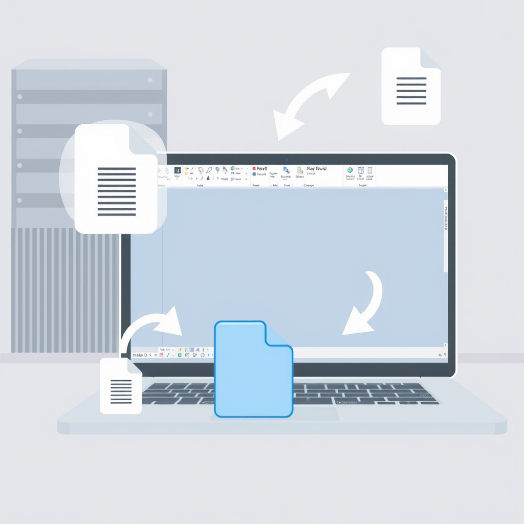

Пайплайн (от английского *pipeline* - "трубопровод") - это последовательность
связанных шагов, которые выполняются в заданном порядке. Этот пайплайн забирает
модели с RevitServer, конвертирует их в NWC и раскладывает по файловым серверам -
своему и заказчика, - а также забирает встречные модели смежников.

---

## 1. Что делает пайплайн

Работа разбита на семь шагов. Их можно включать и выключать по отдельности -
выключенный шаг пайплайн пропускает.

| Шаг | Что делает | Направление |
|---|---|---|
| 01 | Скачивает модели с RevitServer в локальную папку | - |
| 02 | Конвертирует локальные RVT в NWC | - |
| 03 | Выгружает наши NWC на сервер заказчика | отдаём |
| 04 | Выгружает наши RVT на сервер заказчика | отдаём |
| 05 | Выгружает наши NWC на наш файловый сервер | отдаём |
| 06 | Забирает NWC смежников с сервера заказчика на наш сервер | забираем |
| 07 | Забирает RVT смежников с сервера заказчика на наш сервер | забираем |

Порядок шагов задан пайплайном и не меняется: сначала скачивание и конвертация,
затем раскладка по серверам.

---

## 2. Состав пакета

| Файл | Назначение |
|---|---|
| `00_Start_RunScript.ps1` | Главный скрипт. Запускает выбранные шаги по порядку |
| `01_Step1_DownloadFromRevitServer.ps1` | Скачивание моделей с RevitServer |
| `02_Step2_ConvertToNWC.ps1` | Конвертация RVT в NWC |
| `03_Step3_UploadToPartnersNWC.ps1` | Выгрузка NWC заказчику |
| `04_Step4_UploadToPartnersRVT.ps1` | Выгрузка RVT заказчику |
| `05_Step5_UploadToFileServerNWC.ps1` | Выгрузка NWC на наш файловый сервер |
| `06_Step6_SyncFromPartnersNWC.ps1` | Забор NWC смежников |
| `07_Step7_SyncFromPartnersRVT.ps1` | Забор RVT смежников |
| `common.ps1` | Общие функции: запуск утилит, проверка фильтров |
| `log.ps1` | Ведение логов и подсчёт ошибок |
| `vpn.ps1` | Подключение и отключение VPN |
| `config.json` | Все настройки пайплайна |
| `Settings.html` | Страница для наглядной настройки `config.json` |

Скрипты рассчитаны на **Windows PowerShell 5.1** (встроен в Windows 10/11).
Все файлы `.ps1` сохранены в кодировке UTF-8 с BOM - не пересохраняйте их
в других кодировках, иначе кириллица в сообщениях сломается.

---

## 3. Запуск вручную

Кликните правой кнопкой мыши по файлу `00_Start_RunScript.ps1` и выберите
**"Выполнить с помощью PowerShell"**.

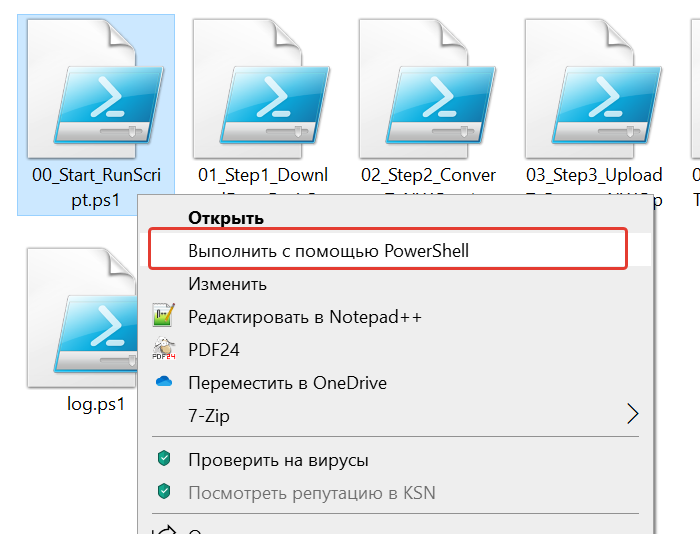

Пайплайн выполнит включённые шаги и запишет ход работы в лог. По завершении он
возвращает **код 0**, если ошибок не было, и **код 1**, если в логе есть хотя бы
одна ошибка. Код возврата пригодится при запуске по расписанию (раздел 7).

---

## 4. Настройка

Все настройки хранятся в файле `config.json` в одной папке со скриптами. Его
можно править и в Блокноте, но удобнее - через страницу `Settings.html`: откройте
её двойным щелчком в браузере. Страница работает без интернета и никуда ничего
не отправляет - она лишь помогает собрать `config.json`.

### 4.1. Панель управления файлом

- **Открыть config.json** - загрузить существующие настройки, чтобы поправить их.
- **Скопировать JSON** - скопировать готовые настройки в буфер обмена.
- **Сохранить** - записать `config.json` (см. раздел 4.7).

Индикатор рядом с названием показывает состояние: файл открыт, есть несохранённые
правки или всё сохранено.

### 4.2. Схема маршрута и выбор шагов

Шаги показаны как поток файлов между серверами. Цвет обозначает направление:
бирюзовым - то, что мы **отдаём** наружу, фиолетовым - то, что **забираем** к себе.

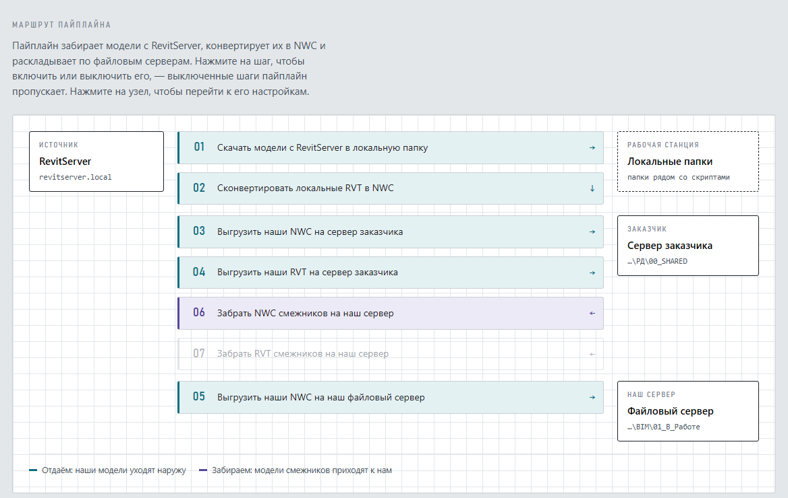

Нажмите на шаг, чтобы включить или выключить его. Выключенный шаг гаснет прямо
на схеме (на рисунке так выключен шаг 07). Нажмите на узел - RevitServer, сервер
заказчика, файловый сервер - чтобы перейти к его настройкам.

### 4.3. Проверка настроек

Ниже схемы страница сама проверяет, всё ли готово к запуску.

Если какому-то включённому шагу не хватает настроек, проверка покажет, чего именно
и какому шагу не хватает, и даст ссылку на нужное поле. Пока всё заполнено -
панель зелёная. Проверяйте её перед сохранением.

### 4.4. RevitServer

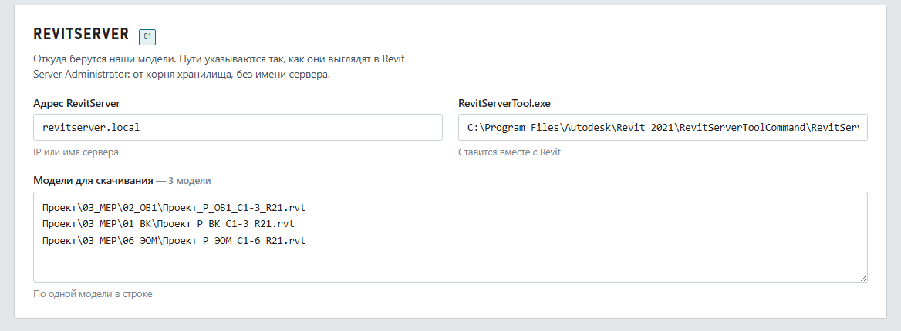

- **Адрес RevitServer** - IP или имя сервера.
- **RevitServerTool.exe** - путь к утилите, которая скачивает модели
 (ставится вместе с Revit).
- **Модели для скачивания** - по одной модели в строке. Путь пишется так, как он
 выглядит в Revit Server Administrator: от корня хранилища, без имени сервера.

### 4.5. Папки, суффиксы и фильтры

Разделы "Рабочая станция", "Сервер заказчика" и "Наш файловый сервер" задают
папки, куда и откуда копируются файлы. У каждого раздела отмечены шаги, которые
его используют; если ни один такой шаг не включён, раздел гаснет.

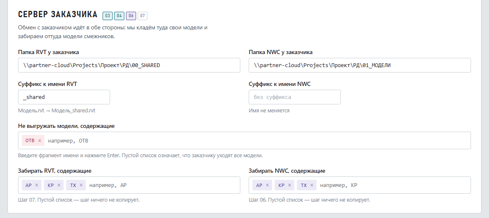

- **Суффикс к имени** - добавляется к имени файла при выгрузке заказчику.
 Под полем показан пример: `Модель.rvt → Модель_shared.rvt`.
- **Не выгружать модели, содержащие** - если имя файла содержит указанный
 фрагмент, заказчику он не уедет (например, `ОТВ` - файлы отверстий).
- **Забирать RVT / NWC, содержащие** - какие модели смежников забирать с сервера
 заказчика (например, `АР`, `КР`, `ТХ`).

Фрагменты имён вводятся как отдельные метки: наберите текст и нажмите Enter.
Пустой список фильтра означает: заказчику уходят все модели, а забирать с его
сервера - нечего.

### 4.6. VPN

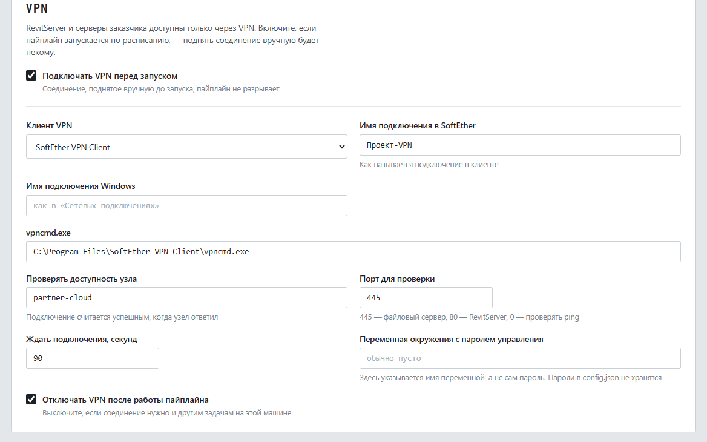

RevitServer и серверы заказчика доступны только через VPN. Подробнее - в разделе 5.

### 4.7. Сохранение

Нажмите **"Сохранить"**. Дальше возможны два варианта - страница сама подскажет,
какой у неё:

- Если браузер умеет записывать файлы напрямую, настройки сохранятся прямо
 в открытый `config.json`.
- Если нет, файл `config.json` уедет в папку загрузок, и его нужно **вручную
 перенести в папку со скриптами**, заменив старый. В этом случае бывает быстрее
 нажать "Скопировать JSON" и вставить содержимое в `config.json` любым редактором.

---

## 5. VPN

Включите VPN в разделе настроек (4.6), если пайплайн запускается по расписанию -
подключить соединение вручную будет некому.

Туннелей может быть несколько: к своему RevitServer, к серверу заказчика,
к серверу подрядчика. Каждый описывается отдельной строкой списка.

В строке туннеля задаются:

- **Выключатель слева** - использовать этот туннель или нет. Так канал заказчика
 отключается на время паузы в работе, а остальные настройки остаются нетронутыми.
- **Название туннеля** - под этим именем туннель виден в логе.
- **Клиент VPN** - SoftEther VPN Client, встроенный VPN Windows, WireGuard
 или OpenVPN. От выбора зависит, какие поля показываются дальше.
- **Имя подключения** - как называется подключение в клиенте VPN: для SoftEther
 имя аккаунта, для встроенного VPN - имя из "Сетевых подключений", для
 WireGuard - имя туннеля, для OpenVPN - имя профиля `.ovpn` без расширения.
- **Проверять доступность узла** - узел, ответ которого подтверждает, что
 соединение действительно поднялось (порт `445` - файловый сервер, `80` -
 RevitServer, `0` - проверять командой ping).
- **Обязательный туннель** - если выключить, пайплайн продолжит работу и в том
 случае, когда этот канал не поднялся.

Стрелками справа задаётся порядок. Туннели поднимаются сверху вниз, а разрываются
в обратном порядке: каналы делят между собой сетевые маршруты, и поднятый
последним может перехватить маршрут по умолчанию.

Как это работает:

- Соединение, поднятое **вручную до** запуска пайплайна, по завершении
 не разрывается - пайплайн трогает только то, что поднял сам.
- Каждый туннель проверяется своим узлом: канал к заказчику может не подняться
 при живом канале к RevitServer.
- Если обязательный туннель не удалось подключить, поднятые до него разрываются,
 шаги не выполняются, а пайплайн завершается с кодом 1. Так прогон не отработает
 вхолостую с ошибками доступа к папкам.

> **О паролях.** Пароль VPN-подключения хранится в самом клиенте VPN, а не в
> `config.json`. В поле "Переменная окружения с паролем" указывается только имя
> переменной, а не сам пароль.

Что нужно каждому клиенту:

- **SoftEther** - служба SoftEther VPN Client должна быть запущена и в режиме
 автозапуска, пайплайн её сам не стартует.
- **Встроенный VPN Windows** - подключение должно быть заведено в "Сетевых
 подключениях".
- **WireGuard** - туннель должен быть установлен как служба. Это делается один
 раз администратором; если службы нет, пайплайн пишет в лог готовую команду
 установки.
- **OpenVPN** - годится профиль с авторизацией по сертификату. Профиль, который
 спрашивает логин и пароль в окне, по расписанию поднять нельзя: отвечать на
 запрос некому, и пайплайн скажет об этом в логе.

Туннелям WireGuard и OpenVPN нужны права администратора: в задаче Планировщика
включите "Выполнить с наивысшими правами".

---

## 6. Логи

Каждый запуск пишет ход работы в папку `Logs` рядом со скриптами: отдельный файл
с датой и временем. По логу видно, какие шаги выполнялись, сколько файлов
скопировано и где возникли ошибки (строки с пометкой `ERROR`). Смотрите лог, если
что-то не сработало.

---

## 7. Запуск по расписанию (Планировщик заданий)

Чтобы пайплайн запускался автоматически, добавьте его в Планировщик заданий Windows.

### 7.1. Открыть Планировщик

Нажмите **Win+R**, введите `taskschd.msc` и нажмите Enter.

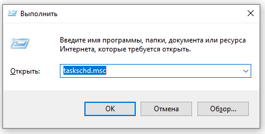

### 7.2. Создать задачу

На правой панели действий выберите **"Создать задачу…"** (не "простую задачу").

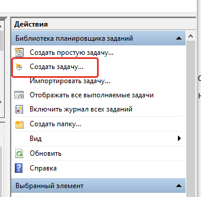

### 7.3. Вкладка "Общие"

Задайте имя задачи. Обязательно включите **"Выполнить с наивысшими правами"** -
иначе задача завершится сразу после запуска.

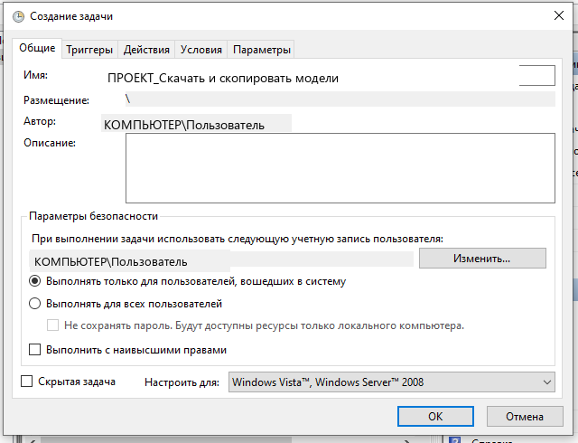

### 7.4. Вкладка "Триггеры"

Нажмите **"Создать"** и задайте расписание - например, в 21:00 каждый день
с воскресенья по четверг.

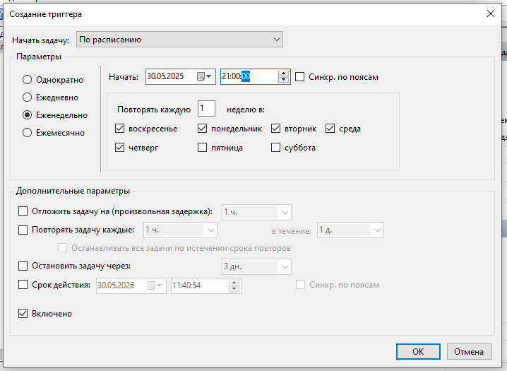

### 7.5. Вкладка "Действия"

Нажмите **"Создать…"** и заполните:

- **Программа или сценарий:** `powershell.exe`
- **Добавить аргументы:** `-File "полный путь к 00_Start_RunScript.ps1 в кавычках"`
- **Рабочая папка:** полный путь к папке со скриптами, без кавычек и без
 завершающего слеша.

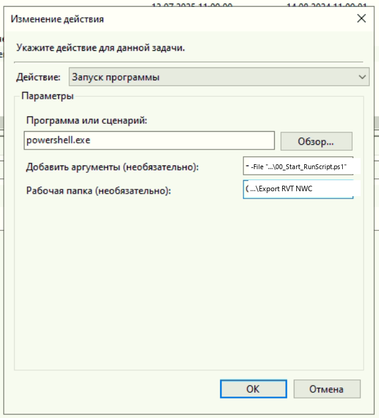

### 7.6. Вкладки "Условия" и "Параметры"

Настройте по своему усмотрению или оставьте значения по умолчанию. Нажмите "ОК" -
задача создана.

---

## 8. История версий

- **2.5** - к SoftEther и встроенному VPN Windows добавлены клиенты WireGuard
 и OpenVPN.
- **2.4** - VPN настраивается списком туннелей: у каждого свой клиент, своё имя
 подключения, свой проверяемый узел и свой выключатель. Туннель можно пометить
 необязательным.
- **2.3** - на странице настроек: подстановка стандартного пути к утилитам по
 выбранной версии (2020-2026) и автокоррекция направления слешей в путях;
 вывод RevitServerTool читается в правильной кодировке (кириллица в логе).
- **2.2** - переработана страница настроек `Settings.html`: схема маршрута,
 проверка настроек, метки-фильтры, работа без интернета.
- **2.1** - добавлено подключение VPN (SoftEther и встроенный VPN Windows).
- **2.0** - устранены критичные ошибки: единая кодировка UTF-8 с BOM, надёжный
 запуск внешних утилит, достоверный статус пайплайна и код возврата.
- **1.3** - выгрузка NWC на свой файловый сервер; журнал по каждой модели
 отдельно; фильтр моделей, не выгружаемых заказчику (например, `ОТВ`).
- **1.2** - исправлен вызов `log.ps1` для работы из Планировщика заданий.